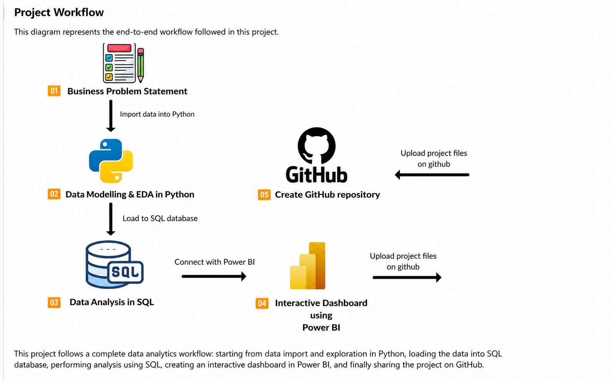

# 🛍️ Customer Behavior Analysis

## End-to-End Data Analytics Project using Python, PostgreSQL & Power BI


---

## 📌 Project Overview

This project demonstrates a complete end-to-end Data Analytics workflow using **Python, PostgreSQL, SQL, and Power BI**.

The objective is to analyze customer shopping behavior, identify purchasing patterns, and transform raw data into meaningful business insights through data cleaning, SQL analysis, and interactive dashboard visualization.

The project simulates a real-world analytics workflow commonly followed by Data Analysts and Business Intelligence professionals.

---

# 🚀 Project Workflow

The project follows the workflow shown below.

<p align="center">
  
</p>

---

# 📊 Dashboard Preview

The final interactive dashboard created in Power BI.

<p align="center">
  
</p>

---

# 🛠️ Technologies Used

- Python
- Pandas
- NumPy
- PostgreSQL
- SQLAlchemy
- PostgreSQL (pgAdmin)
- Power BI
- VS Code
- Jupyter Notebook

---

# 📂 Project Workflow

### 1️⃣ Business Understanding
- Defined the business problem.
- Understood customer shopping behaviour.

### 2️⃣ Data Cleaning & EDA (Python)

- Imported dataset
- Cleaned missing values
- Removed duplicates
- Corrected data types
- Performed Exploratory Data Analysis

---

### 3️⃣ Database Management (PostgreSQL)

- Created PostgreSQL database
- Connected Python with PostgreSQL
- Loaded cleaned dataset into SQL
- Verified data using pgAdmin

---

### 4️⃣ SQL Analysis

Performed SQL queries to answer business questions such as:

- Revenue Analysis
- Product Category Performance
- Customer Segmentation
- Shopping Mall Performance
- Payment Method Analysis
- Average Purchase Value
- Customer Demographics
- Sales Trends

---

### 5️⃣ Dashboard Development (Power BI)

Built an interactive Power BI dashboard including:

- KPI Cards
- Revenue Analysis
- Sales Analysis
- Customer Demographics
- Category Analysis
- Payment Method Analysis
- Interactive Filters & Slicers

---

# 📁 Repository Structure

```text
customer-behavior-analysis/
│
├── data/
│   └── customer_shopping_behavior.csv
│
├── notebooks/
│   └── Customer_Shopping_Behavior_Analysis.ipynb
│
├── sql/
│   └── customer_behavior_sql_queries.sql
│
├── dashboard/
│   └── customer_behavior_dashboard.pbix
│
├── images/
│   ├── workflow.png
│   └── dashboard.png
│
└── README.md
```

---

# ⚙️ Getting Started

### Clone Repository

```bash
git clone https://github.com/yourusername/customer-behavior-analysis.git
cd customer-behavior-analysis
```

### Install Dependencies

```bash
pip install pandas numpy sqlalchemy psycopg2-binary jupyter
```

### Create PostgreSQL Database

Create a PostgreSQL database named:

```
customer_behavior
```

### Run the Notebook

Open:

```
Customer_Shopping_Behavior_Analysis.ipynb
```

The notebook performs:

- Data Import
- Data Cleaning
- Data Exploration
- PostgreSQL Connection
- Data Loading into SQL

### Execute SQL Queries

Run:

```
customer_behavior_sql_queries.sql
```

using pgAdmin.

### Open Power BI Dashboard

Open:

```
customer_behavior_dashboard.pbix
```

Refresh the PostgreSQL connection to visualize the latest data.

---

# 📈 Skills Demonstrated

- Data Cleaning
- Exploratory Data Analysis (EDA)
- SQL Querying
- Database Management
- ETL Workflow
- Power BI Dashboard Development
- Data Visualization
- Business Intelligence
- Data Storytelling

---


---

⭐ If you found this project useful, consider giving it a star!
